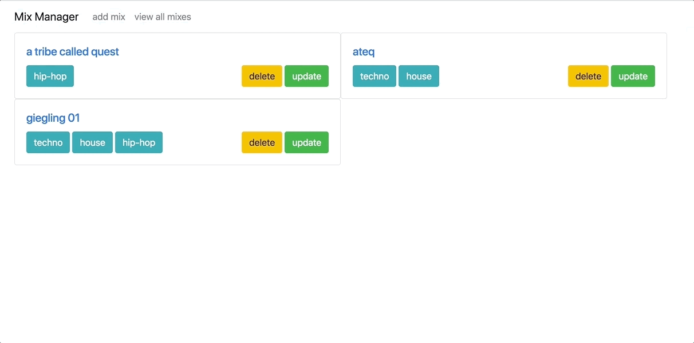
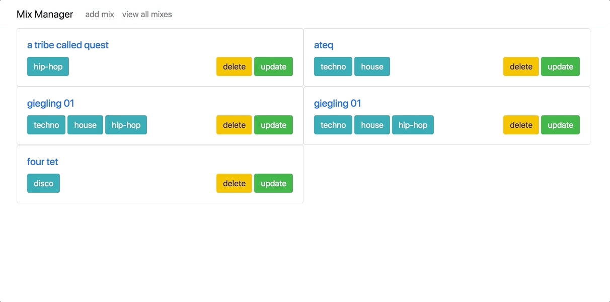

# Music Mix Manager

A speedily built web app that lets music lovers save and tag their favourite mixes, and once listened, delete.

I approached this app in more of a BDD way - that is writing only integration tests rather than unit tests. The approach was influenced by this awesome [ThoughtBot tutorial](https://thoughtbot.com/upcase/test-driven-rails).

## How to use
* This app uses a postgres db so check if you have it installed `$ psql -v`
* `$ brew install postgresql` if you need postgres installing
* `$ git clone https://github.com/chrisjgilbert/music-mix-manager`
* `$ bundle` to install dependencies
* `$ rake db:create` to create the database
* `$ rails s` to run the server
* `http://localhost:3000/` to get started!

## To run the tests    
* `$ rake`

## To run the linter   
* `$ rubocop`

## Screenshots

### Add new mix

### View mixes by tag   

